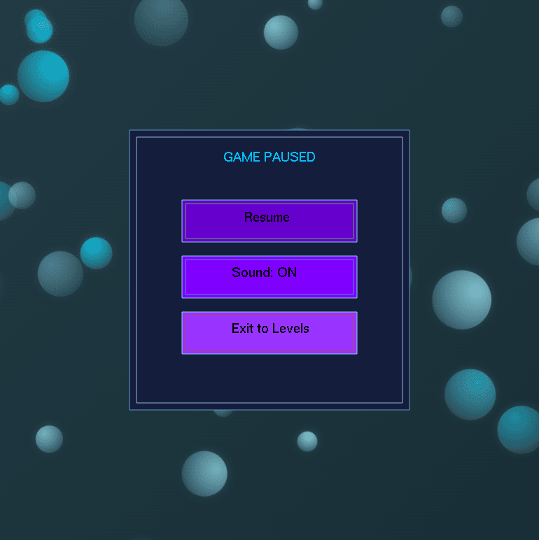

# 🎯 Bubble Shooter Game

Welcome to the **Bubble Shooter Game**, a classic arcade-style
game developed as part of our Term Project for the CSE 102 course. 
The game is built using the **Modern iGraphics** library in C, offering an 
engaging experience with colorful bubbles, strategic shooting mechanics,
and a fun interface.  
The goal of the game is to clear all the bubbles by shooting them strategically.  
Additional features like level-based progression, game-over logic, and a polished 
UI have been added to enhance the overall experience.

---

## 🕹️ How to Play

1. **Download** and **extract** the `release.zip` file.
2. Run the executable: `game.exe`.
3. Enjoy the game!

## 🎥 Project Video Demonstration

Watch the full gameplay and feature demonstration here:  
👉 [Watch on YouTube](https://www.youtube.com/watch?v=giuJmsYUpS8&t=2s&ab_channel=Md.RaihanKabirSifat)

---

## 🖼️ Screenshots

### Home Menu  

### Settings  

### Tribute  

### High Score  

### Instructions  

### Prompt For Name  

### Game Play Screen  

### Game Pause Screen  

### Level Completion Screen  

### Game Over  

---

## 👨‍🏫 Supervisor Information

**Course Name:** CSE 102 — Structured Programming Language Sessional  
**Supervisor Name:** *Mahir Labib Dihan*  *Adjunct Lecturer* *CSE, BUET*  
**Department:** Computer Science and Engineering  
**Institution:** Bangladesh University of Engineering and Technology (BUET)
